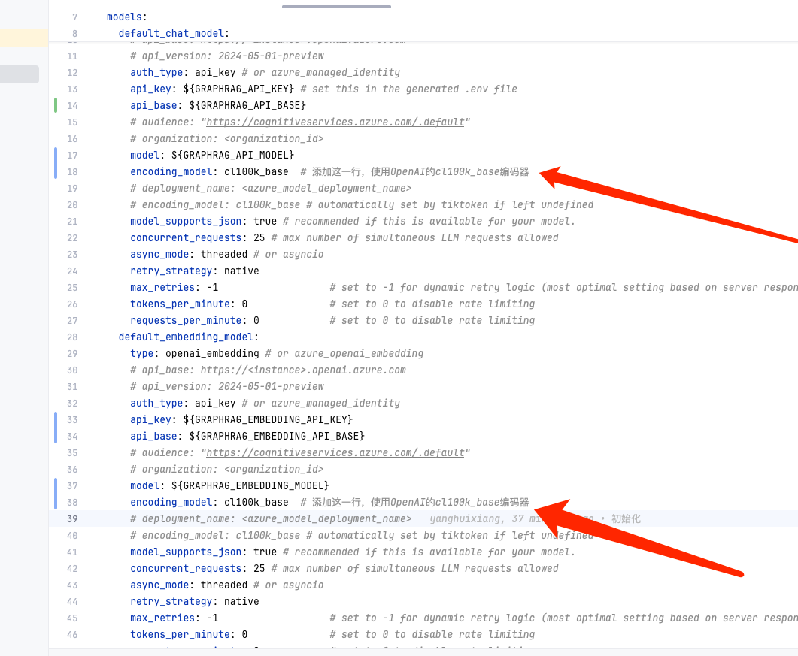
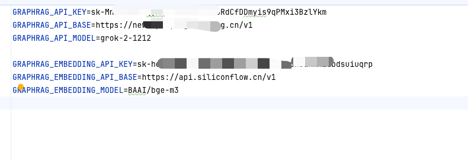
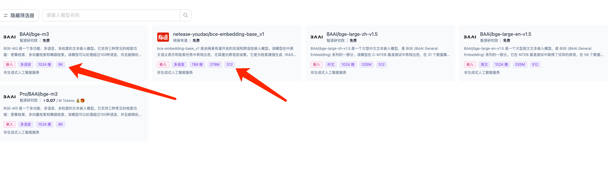
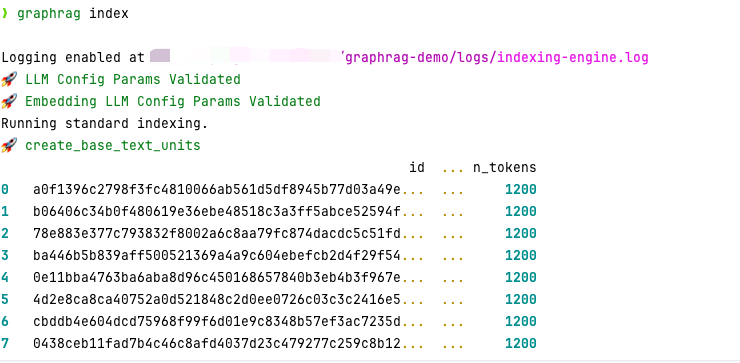
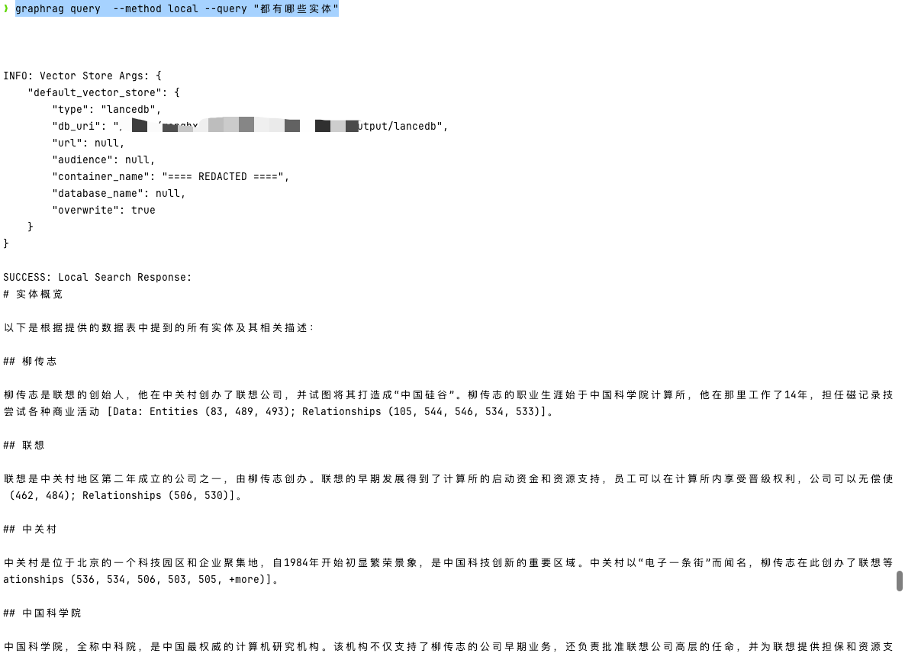
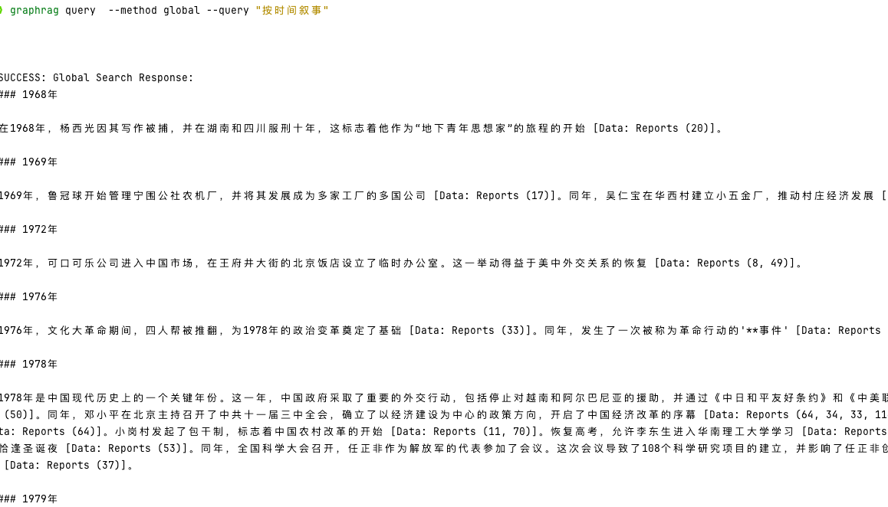

## 运行环境

AI 相关的库是更新最快的，可能刚学完的东西，过两天就更新了。所以版本很重要。

- Python 3.12
- graphrag-2.1.0
`pip install graphrag==2.1.0`

其余的依赖都是依赖自动下载的


## 1 初始化

`graphrag init --root graphrag-demo`

 生成基本目录结构

```
graphrag-demo
├── prompts
│   ├── basic_search_system_prompt.txt                           # 基础搜索系统提示文件
│   ├── community_report_graph.txt                               # 社区报告图谱生成提示文件
│   ├── community_report_text.txt                                # 社区报告文本生成提示文件
│   ├── drift_reduce_prompt.txt                                  # 漂移减少提示文件
│   ├── drift_search_system_prompt.txt                           # 漂移搜索系统提示文件
│   ├── extract_claims.txt                                       # 提取声明/主张的提示文件
│   ├── extract_graph.txt                                        # 从文本提取图谱关系的提示文件
│   ├── global_search_knowledge_system_prompt.txt                # 全局搜索知识系统提示文件
│   ├── global_search_map_system_prompt.txt                      # 全局搜索映射系统提示文件
│   ├── global_search_reduce_system_prompt.txt                   # 全局搜索归约系统提示文件
│   ├── local_search_system_prompt.txt                           # 本地搜索系统提示文件
│   ├── question_gen_system_prompt.txt                           # 问题生成系统提示文件
│   ├── summarize_descriptions.txt                               # 描述摘要生成提示文件
├── settings.yaml                                                # 配置文件，包含模型设置、输入输出设置等
└── .env                                                         # 环境变量文件，存储API密钥等敏感信息
```


## 2 修改提示词

将 `extract_claims.txt` 和 `extract_graph.txt` 中 `English` 改为 `Chinese`。 让其返回中文的实体和关系。

## 3 配置

改造下settings.yaml，将 `.env` 中的环境变量配置上






我使用的是 `grok-2-1212`,会出现 `encoding_model`找不到的错误，需要手动指定下。
然后 embedding_model 我用的硅基流动，实测火山豆包会报错。要选一个token大的模型，否则会报错




## 4 运行

`graphrag index`



## 5 查询

### 社区查询

`graphrag query  --method local --query "都有哪些实体"`


### 全局查询

`graphrag query  --method global --query "按时间叙事"`

